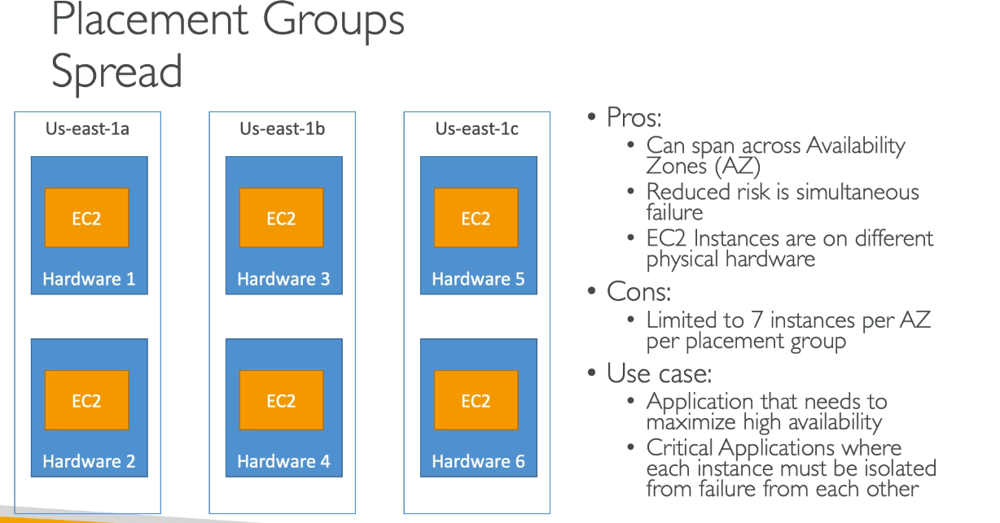

# EC2 for SysOps

### Launching an EC2 Instance

* Navigate to EC2 Management Console and 'Launch Instance'
* Name and tag the instance as appropriate
* Select the Amazon Machine Image (AMI)&#x20;
* Create a key pair which allows you to connect to your instance securely
* Customise the network settings to ensure only SSH allowed on port 22

#### Connecting to your EC2 Instance

* Once the EC2 instance is launched, copy the public IPv4 address
* On the CLI, navigate to the Downloads directory
* chmod 0400 keypair.pem
* ssh -i keypair.pem ec2-user@public-IPv4-address

### Changing an EC2 Instance Type

* This only works for EBS backed instance
* EBS-optimized means that you are going to have better throughput to your EBS volumes and is available tot newer generations of instance types.
* Stop the instance -> instance settings -> change instance type -> start instance

### Enhanced Networking

* EC2 Enchanced Networking (SR-IOV)
  * Higher bandwidth, higher PPS (packets per second), lower latency
  * Option 1: Elastic Network Adapter (ENA) up to 100 GBps
  * Option 2: Intel 82599 VF up to 10 Gbps - LEGACY
  * Works for newer generation of EC2 instances
* Elastic Fabric Adapter (EFA)
  * Improved ENA for HPC, only works for Linux
  * Great for inter-node communications, tightly coupled workloads
  * Leverage Message Passing Interface (MPI) standard
  * Bypasses the underlying Linux OS to provide low-latency, reliable transport

If you want enhanced networking for lower latency, look for the Elastic Network Adapter.

If you have a HPC cluster, look for the Elastic Fabric Adapter (EFA) on top of it to improve performance.

### EC2 Placement Groups

* Sometimes we want control over the EC2 Instance placement strategy
* That strategy can be defined using placement groups
* When you create a placement group, you specify one of the following strategies for the group:
  * Cluster - cluster instances into a low-latency group in a single Availability Zone
  * Spread - spread instances across underlying hardware (max 7 instances per group per AZ) - critical applications
  * Partition - spread instances across many different partitions (which rely on different sets of racks) within an AZ. Scales to hundred of EC2 instances per group (Hadoop, Cassandra, Kafka).

#### Cluster

<figure><figcaption></figcaption></figure>

#### Spread

<figure><figcaption></figcaption></figure>

#### Partition

<figure><figcaption></figcaption></figure>

### EC2 Shutdown Behaviour & Termination Protection

* Shutdown Behaviour: How should the instance react when shutdown is done using the OS?
  * Stop (default)
  * Terminate (This means the EC2 instance is destroyed completely)
  * This is not applicable when shutting down from AWS console.
  * CLI Attribute: InstanceInitiatedShutdownInstance
* Termination Protection:
  * To protect agaisnt accidental termination in AWS Console or CLI
* Exam Tip:
  * We have an instance where shutdown behaviour = terminate and enable terminate protection is ticked
  * We shutdown the instance from the OS, what will happen?
  * The instance will still be terminated because you haven't been doing this from the console but you have done this from within the OS using sudo shutdown.

### EC2 Launch Troubleshooting

#### InstanceLimitExceeded:

* if you get this error, it means that you have reached your limit of max number of vCPUs per region
* On-Demand instance limits are set per-region basis
  * Example: if you run on-demand (A,C,D,H,I,M,R,T,Z) instance types, you will have 64 vCPUs (default)
* Resolution: Either launch the instance in a different region or request AWS to increase your limit of the region
* NOTE: vCPU-based limits only apply to running On-Demand instances and Spot Instances

#### InsufficientInstanceCapacity

* If you get this error, it means AWS does not have enough On-Demand capacity in the particular AZ where the instance is launched.
* Resolution:
  * Wait for a few minutes before requesting again
  * If you are requesting more than 1, break down the requests.

#### Instance Terminates Immediately (goes from pending to terminated)

* You have reached your EBS volume limit
* An EBS snapshot is corrupt
* The root EBS volume is encrypted and you do not have permissions to access the KMS key for decryption.
* The instance store-backed AMI that you used to launch the instance is missing a required part (an image.part.xx file)
* To find the exact reason, check out the EC2 console of AWS - instances - Description tab and note the reason next to the State transition reason label.

### EC2 SSH Troubleshooting

* Make sure the private key (pem file) on your linux machine has 400 permissions, else you will get the "Unprotected private key file" error.
* Make sure the username for the OS is given correctly when logging via SSH, else you will get the "Host key not found", "Permission denied", or "Connection closed by \[instance] port 22" errors.
* Possible reasons for "Connection timed out" to EC2 instance via SSH:
  * Security group is not configured correctly.
  * Network Access Control Group is not configured correctly
  * Check the route table for the subnet (routes traffic destined outside virtual private cloud to IGW).
  * Instance does not have a public IPv4.
  * CPU load of the instance is too high.

#### SSH vs. EC2 Instance Connect

<figure><figcaption></figcaption></figure>

### EC2 Instances Purchasing Options

* On-Demand Instances - short workload, predictable pricing, pay by second
* Reserved (1 & 3 year terms)
  * Reserved Instances - long workloads
  * Convertible Reserved Instances - long workloads with flexbile instances
* Savings Plan (1 & 3 years) - commitment to an amount of usage, long workloads
* Spot Instances - short workloads, cheap, can lose instances (less reliable)
* Dedicated Hosts - book an entire physical server, control instance placement
* Dedicated Instances - no other customers will share your hardware
* Capacity Reservations - Reserve capacity in a specific AZ for any duration

#### EC2 On Demand

* Pay for what you use:
  * Linux or Windows - billing per second, after the first minute
  * All other operating systems - billing per hour
* Has the highest cost but no upfront payment
* No long-term commitment
* Recommended for short-term and un-interrupted workloads, where you cannot predict how the application will behave

#### Reserved Instances

* Up to 72% discount compared to on-demand
* You reserve a specific instance attributes (instance types, region, tenancy, OS)
* Reservation period - 1 year (+discount) or 3 years (most discounted)
* Payment options - No Upfront, Partial upfront, all upfront (most discount)
* Reserved instance's scope - regional or zonal (reserve capacity in an AZ)
* Recommended for steady-state usage applications (think databases)
* You can buy and sell in the Reserved Instance Marketplace
* Convertible Reserved Instances
  * Can change the EC2 instancce type, instance family, OS, scope and tenancy
  * Up to 66% discount

#### EC2 Savings Plan

* Get a discount based on long-term usage (up to 72% - same as RIs)
* Commit to a certain type of usage
* Usage beyond EC2 Savings Plans is billed at the On-Demand price
* Locked to a specific instance family & AWS region (e.g. M5 in us-east-1)
* Flexible across:
  * Instance Size (e.g. m5.xlarge, m5.2xlarge)
  * OS (e.g. Linux, Windows)
  * Tenancy (Host, Dedicated, Default)

#### EC2 Spot Instances

* Can get a discount of up to 90% compared to On-Demand
* Instances that you can "lose" at any point of time if your max price is less than the current spot price
* The MOST cost-effective instances in AWS.
* Useful for workloads that are resilient to failure:
  * Batch jobs
  * Data analysis
  * Image processing
  * Any distributed workloads
  * Workloads with a flexible start and end time
* Not suitable for critical jobs or databases!

#### EC2 Dedicated Hosts

* A physical server with EC2 instance capacity fully dedicated to your use
* Allows you to address compliance requirements and use your existing server-bound software licences (per-socket, per-core)
* Purchasing Options:
  * On-demand - pay per second for active Dedicated Host
  * Reserved - 1 or 3 years (no upfront, partial upfront, all upfront)
* The most expensive option
* Useful for software that has complicated licensing model (BYOL - Bring your own license)

#### EC2 Dedicated Instances

* Instances run on hardware that is dedicated to you
* May share hardware with other instances in the same account
* No control over instance placement (can move hardware after stopping and starting)

#### EC2 Capacity Reservations

* Reserve on-demand instances capacity in a specific AZ for any duration
* You always have access to EC2 capacity when you need it
* No time commitment (create/cancel anytime), no billing discounts
* Combine with Regional Reserved Instances and Savings Plans to benefit from billing discounts
* You are charged at on-demand rate whether you run instances or not
* Suitable for short-term, uninterrupted workloads that needs to be in a specific AZ

#### Which purchasing option is right for me? (Resort analogy)

* On-Demand: coming and staying in a resort whenever we like, we pay the full price.
* Reserved: you are planning ahead and if we plan for a long time, we get a good discount
* Savings plan: pay a certain amount per hour for certain period and stay in any room
* Spot instances: the resort allows people to bid for the empty rooms and the highest bidder keeps the room. However, you can get kicked out at any time.
* Dedicated Hosts: I want to book the entire resort.
* Capacity Reservations: I want to book a room for a period with full price even if I do not stay in it.

#### EC2 Spot Instance Requests

* Can get a discount of up to 90% compared to on-demand
* Define max spot price and get the instance while current spot price < max
  * The hourly spot price varies based on offer and capacity
  * If the current spot price > your max price, you can choose to stop or terminate your instance within a 2 minute grace period.
* Other strategy: Spot Block
  * "block" spot instance during a specified time frame (1 to 6 hours) without interruptions
  * In rare situations, the instance may be reclaimed.

### Burstable Instances (T2/T3)

* AWS has the concept of burstable instances (T2/T3 machines)
* Burst means that overall, the instance has ok CPU performance but when the machine needs to process something unexpected (a spike in load for example), it can burst, and CPU can be very good.
* If the machine bursts, it utilises "burst credits"
* If all the credits are gone, the CPU becomes bad.
* If the machine stops bursting, credits are accumulated over time

#### T2/T3 Unlimited

* It is possible to have an "unlimited burst credit balance"&#x20;
* You pay extra money if you go over the credit balance, but you do not lose performance
* If the average CPU usage over a 24-hpur period exceeds the baseline, the instance is billed for additional usage per vCPU/hour
* Be careful as costs could go high if you are not monitoring the CPU health of your instances.

### Elastic IP

* When you stop and then start an EC2 instance, it changes its public IP address.&#x20;
* If you need to have a fixed public IP, you need an elastic IP
* An elastic IP is a public IPv4 you own as long as you do not delete it.
* You can attach it to one instance at a time
* You can remap it across instances
* You do not pay for the elastic IP if it's attached to a server

You can mask the failure of an instance or software by rapidly remapping the address to another instance in your account.&#x20;

You can only have 5 elastic IPs in your account

How can you avoid using elastic IP:

* Always think if other alternatives are available to you
* You can use a random public IP and register a DNS name to it&#x20;
* Or use a Load Balancer with a static hostname

### CloudWatch Metrics for EC2

* AWS provided metrics (AWS pushes them):
  * Basic monitoring (default): metrics are collected at a 5-minute interval
  * Detailed monitoring (paid): metrics are collected at a 1-minute interval
  * Includes CPU, Network, Disk and Status Check metrics
* Custom Metric (yours to push):
  * Basic resolution: 1 minute
  * High resolution: all the way to 1 second
  * Include RAM, application level metrics
  * Make sure the IAM permissions on the EC2 instance role are correct to allow it to push metrics to CloudWatch

#### EC2 Included Metrics

* CPU: CPU Utilisation + credit usage / balance
* Network: Network in and out
* Status check:
  * Instance status = check the EC2 VM
  * System status = check the underlying hardware
* Disk: Read / Write for Ops / Bytes (only for instance store)
* RAM is NOT included&#x20;

#### Unified CloudWatch Agent

* For virtual servers (EC2 instances, on-premises servers)
* Collect additional system-level metrics such as RAM, processes, used disk space, etc.
* Collect logs to send to CloudWatch Logs
  * No logs from inside your EC2 instance will be sent to CloudWatch Logs without using an agent
* Centralised configuration using SSM Parameter Store
* Make sure IAM permissions are correct

#### Unified CloudWatch Agent - procstat Plug-in

* Collect metrics and monitor system utilisation of individual processes
* Supports both Linux and Windows servers
* Example: amount of time the process uses CPU, amount of memory the process uses
* Select which processes to monitor by:
  * pid\_file - name of process identification number (PID) files they create
  * exe - process name that matches the string you specify (RegEx)
  * pattern - command lines used to start the processes (RegEx)
* Metrics collected by procstat plugin begins with "procstat" prefix

### Status Checks

* Automated checks to identify hardware and software issues
*   **SYSTEM status checks**

    System status checks monitor the _AWS systems_ on which your instance runs

    * Problem with the underlying host. Example:&#x20;
      * Loss of network connectivity
      * Loss of system power
      * Software issues on the physical host
      * Hardware issues on the physical host that impact network reachability
    * Either wait for AWS to fix the host, OR
    * Move the EC2 instance to a new host = STOP & START the instance (if EBS backed)\

    **INSTANCE status checks**

    Instance status checks monitor the software and network configuration of _your individual instance_

    * Example of issues
      * Incorrect networking or startup configuration
      * Exhausted memory
      * Corrupted file system
      * Incompatible kernel
    * Requires your involvement to fix
    * Restart the EC2 instance, OR
    * Change the EC2 instance configuration

#### Status Checks - CloudWatch Metrics and Recovery

* CloudWatch Metrics (1 minute interval)
  * StatusCheckFailed\_System
  * StatusCheckFailed\_Instance
  * StatusCheckFailed (for both)
* Option 1: CloudWatch Alarm
  * Recover EC2 instancce with the same private/public IP, EIP, metadata and placement group
  * Send notification using SNS
* Option 2: Auto Scaling Group
  * Set min/max/desired to 1 to recover an instance but won't keep the same private and elastic IP

### EC2 Hibernate

* We know we can stop and terminate instances
  * STOP - the data on disk (EBS) is kept intact in the next start
  * TERMINATE - any EBS volumes (root) also set-up to be destroyed or lost
* On start, the following happens:
  * First start, the OS boots and the EC2 User Data script is run
  * Following starts: the OS boots up
  * Then your application starts, caches get warmed up and that can take some time
* With EC2 Hibernate:
  * The in-memory (RAM) state is preserved
  * The instance boot is faster (the OS is not stopped / restarted)
  * Under the hood, the RAM state is written to a file in the root EBS volume
  * The root EBS volume must be encrypted.
* Use Cases:
  * Long-running processes
  * Saving the RAM state
  * Services that take time to initialise

